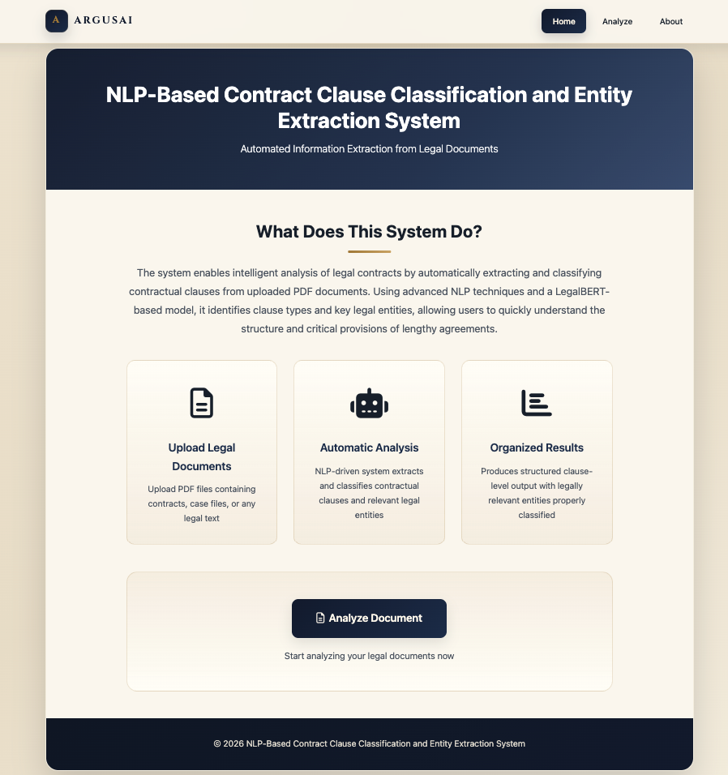
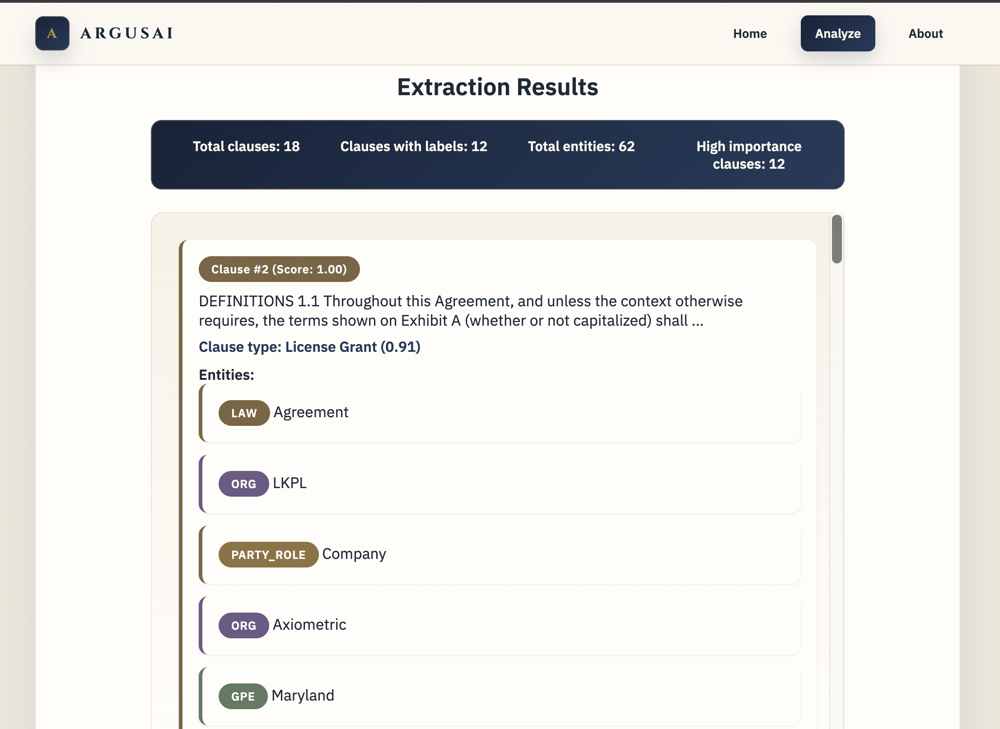
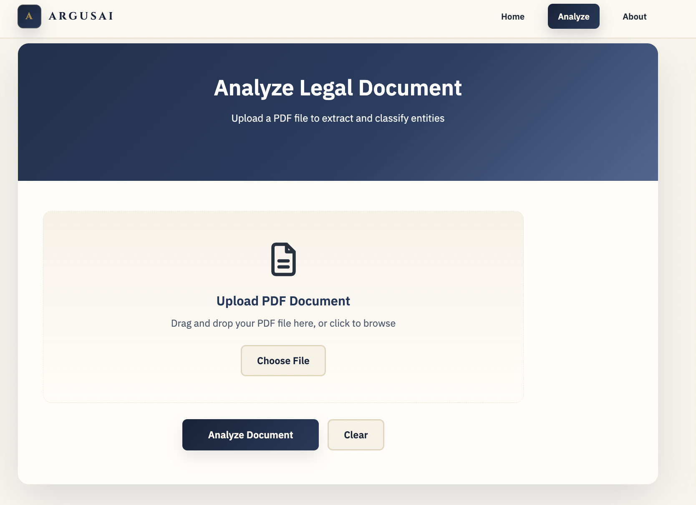
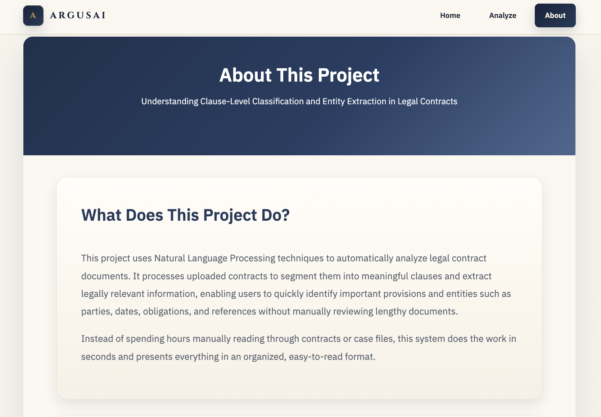

# 📄 NLP-Based Contract Clause Classification & Entity Extraction

An **end-to-end legal document analysis system** that automatically **classifies contract clauses** and **extracts legal entities** using **LegalBERT + NLP**, wrapped in a clean Flask web application 🚀

---

## ✨ Features

- ✅ Upload **PDF / TXT legal documents**
- ✅ Automatic **clause segmentation & classification**
- ✅ **Named Entity Recognition (NER)** for legal entities

- ✅ Interactive UI 

- ✅ Flask-based backend API

---

## 🧠 Powered By

- 🤖 **LegalBERT** (fine-tuned)
- 🧪 NLP pipelines for clause classification
- 🔍 Entity extraction (NER)
- 🐍 Python + Flask backend
- 🎨 HTML / CSS / Vanilla JavaScript frontend

---

## 🗂️ Project Structure

```text
LegalBert/
│
├── backend/
│   ├── app.py                  # Flask backend
│   ├── models/                 # Trained LegalBERT model
│   └── utils/
│       ├── inference.py        # Model inference logic
│       └── pdf_extractor.py    # PDF text extraction
│
├── frontend/
│   ├── templates/
│   │   ├── index.html          # Home page
│   │   ├── analyze.html        # Analyze page
│   │   └── about.html
│   │
│   └── static/
│       ├── styles.css          # Global styles
│       ├── analyze.css         # Analyze page styles
│       └── analyze.js          # Frontend logic
│
├── uploads/                    # Temporary uploaded files
└── README.md
```

---

## .pt file link


---

## 🖥️ Frontend Highlights

### 📤 File Upload
- Drag & drop or **Choose File**
- Supports `.pdf` and `.txt`

### 📊 Results Summary
- Total clauses
- Clauses with labels
- Total entities
- High-importance clauses

### 📑 Clause Viewer
- Shows **Top 10 clauses** by default
- 🔘 **View More** → see all classified clauses
- 🔁 Toggle back to **Top 10**

### 🏷️ Entity Display
- Entity label + text

---

## 🚀 How to Run

1. **Create virtual environment**
   ```bash
   python3 -m venv .venv
   source .venv/bin/activate   # Windows: .venv\Scripts\activate
    ```

2. **Install dependencies**
   ```bash
   pip install -r requirements.txt
   ```

3. **Add the classifier checkpoint**

   Place the trained model at:

   ```text
   backend/models/best_legal_classifier.pt
   ```

   This file is large and should be kept as a local artifact, not committed as a normal Git file.

4. **Start the server**
   ```bash
   cd backend
   python app.py
   ```

5. **Open the app**

   Visit `http://127.0.0.1:5500`.

> Entity extraction uses Ollama at `http://localhost:11434` with `phi3:mini`. If Ollama is not running, clause classification still works and entity extraction falls back to an empty list.

---
## 🎯 Use Cases

- 📜 **Contract review**  
- ⚖️ **Legal compliance analysis**  
- 📚 **Academic legal NLP research**  
- 🏢 **Enterprise contract intelligence**

---

## Contributors

- [Niveditha](https://github.com/marvelcodeX)
- [Aastha](https://github.com/AasthathecoderX)

---

## Demo Images

| | |
|---|---|
|  |  |
|  |  |

